# 🧠 Enterprise Local RAG: Private AI Knowledge Base (Docker + Llama 3)

> **Stop sending your sensitive engineering data to the cloud.**
>
> This project provides a production-grade, **100% offline RAG (Retrieval-Augmented Generation)** architecture. It allows you to chat with your proprietary documents (PDF, TXT, Markdown) using a local LLM, ensuring absolute data privacy.

---

## 🏗️ System Architecture

This system is designed with a microservices architecture, fully containerized using **Docker Compose** for one-click deployment.

### 🛠️ Tech Stack
* **LLM Inference:** [Ollama](https://ollama.com/) (Running **Meta Llama 3** 8B)
* **Embeddings:** `mxbai-embed-large` (State-of-the-art retrieval performance)
* **Vector Database:** [ChromaDB](https://www.trychroma.com/) (Persistent local storage)
* **Backend/Frontend:** Python + Streamlit (Optimized for RAG workflows)
* **Deployment:** Docker Compose (Isolated environment)

---

## ✨ Key Features

* **🔒 100% Privacy:** No data leaves your machine. No OpenAI API keys required. Zero monthly fees.
* **🚀 GPU Acceleration:** Native support for NVIDIA GPUs (CUDA) for lightning-fast inference.
* **📂 Smart Ingestion:** Automatically parses, chunks, and vectorizes PDF and text documents.
* **💬 Context-Aware Chat:** Remembers conversation history and retrieves relevant context from your knowledge base.
* **🐳 One-Click Setup:** No "dependency hell". Just run `docker-compose up -d`.

---

## 🎥 Live Demo

Click the image below to watch the system in action:

[Watch the Demo](https://www.youtube.com/watch?v=Bjw8hNpwWdE)

## 📸 Screenshots

### 1. Chat Interface (Streamlit)
[Chat UI]

[Ingestion Process]

```mermaid
graph TD
    subgraph Docker_Container [🐳 Docker Containerized Environment]
        style Docker_Container fill:#e1f5fe,stroke:#01579b,stroke-width:2px,rx:10,ry:10
        
        UI["🖥️ Streamlit Web UI"]:::ui
        Backend["⚙️ Python RAG Backend"]:::code
        
        subgraph Local_AI [🧠 Local AI Engine]
            style Local_AI fill:#fff3e0,stroke:#ff6f00,stroke-width:2px
            Ollama["🦙 Ollama Service<br/>(Llama 3 Model)"]:::ai
            Embed["✨ Embedding Model<br/>(mxbai-embed-large)"]:::ai
        end
        
        DB[("🗄️ ChromaDB<br/>Vector Store")]:::db
    end

    User([👤 User]) -->|Upload PDF/Ask Question| UI
    UI <-->|API Request| Backend
    Backend <-->|Store/Retrieve Vectors| DB
    Backend <-->|Inference Request| Ollama
    Backend -->|Generate Embeddings| Embed

    classDef ui fill:#d1c4e9,stroke:#512da8,stroke-width:2px,color:black;
    classDef code fill:#c8e6c9,stroke:#2e7d32,stroke-width:2px,color:black;
    classDef db fill:#ffcdd2,stroke:#c62828,stroke-width:2px,color:black;
    classDef ai fill:#fff9c4,stroke:#fbc02d,stroke-width:2px,color:black;
```

## 💻 System Requirements

To run this system smoothly with Llama 3 (8B), the following hardware is recommended:

* **OS:** Windows 10/11 (WSL2) or Linux (Ubuntu)
* **RAM:** 16GB+ System Memory
* **GPU:** NVIDIA RTX 3060 (8GB VRAM) or higher recommended.
    * *Note: The system can run on CPU-only mode, but inference will be slower.*

---

## 📥 Get the Complete System

Building a stable RAG system from scratch takes weeks of configuration (handling Python dependencies, Vector DB connections, and Docker networking).

I have packaged the **Full Source Code**, **Docker Configuration**, and **Setup Guide** into a ready-to-deploy bundle.

### 📦 What's included in the Full Package?
* ✅ **Complete Source Code** (Python)
* ✅ **`docker-compose.yml`** (Production ready)
* ✅ **Embedding & Vectorization Logic**
* ✅ **UI/UX Implementation**
* ✅ **Premium Support Guide**

👉 **Download the System Here:** [**Get it on Gumroad**](https://pokhts.gumroad.com/l/senior-engineer-toolkit)
*(Instant Access. One-time payment. Lifetime usage.)*

---

## 👨‍💻 About the Author
**Phil Yeh** - Senior Automation & Systems Engineer.
Specializing in Hardware-Software Integration, Industrial Automation, and Local AI Solutions.

* [**LinkedIn Profile**]([https://www.linkedin.com/in/PhilYeh](https://www.linkedin.com/in/phil-yeh-204144297/)
* [**My Gumroad Store**]([https://pokhts.gumroad.com/](https://pokhts.gumroad.com/l/ai-knowledge-docker)

---
*Keywords: RAG, Llama 3, Ollama, Docker, Local AI, Private GPT, Knowledge Base, Python, Vector Database, ChromaDB, Source Code*
